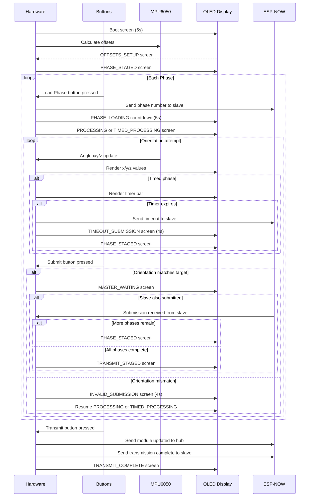

```mermaid
sequenceDiagram
participant HW as Hardware
participant BTN as Buttons
participant MPU as MPU6050
participant OLED as OLED Display
participant ESP as ESP-NOW

    HW->>OLED: Boot screen (5s)
    HW->>MPU: Calculate offsets
    OLED-->>HW: OFFSETS_SETUP screen
    HW->>OLED: PHASE_STAGED screen

    loop Each Phase
        BTN->>HW: Load Phase button pressed
        HW->>ESP: Send phase number to slave
        HW->>OLED: PHASE_LOADING countdown (5s)
        HW->>OLED: PROCESSING or TIMED_PROCESSING screen

        loop Orientation attempt
            MPU->>HW: Angle x/y/z update
            HW->>OLED: Render x/y/z values
            alt Timed phase
                HW->>OLED: Render timer bar
                alt Timer expires
                    HW->>ESP: Send timeout to slave
                    HW->>OLED: TIMEOUT_SUBMISSION screen (4s)
                    HW->>OLED: PHASE_STAGED screen
                end
            end

            BTN->>HW: Submit button pressed
            alt Orientation matches target
                HW->>OLED: MASTER_WAITING screen
                alt Slave also submitted
                    ESP->>HW: Submission received from slave
                    alt More phases remain
                        HW->>OLED: PHASE_STAGED screen
                    else All phases complete
                        HW->>OLED: TRANSMIT_STAGED screen
                    end
                end
            else Orientation mismatch
                HW->>OLED: INVALID_SUBMISSION screen (4s)
                HW->>OLED: Resume PROCESSING or TIMED_PROCESSING
            end
        end
    end

    BTN->>HW: Transmit button pressed
    HW->>ESP: Send module updated to hub
    HW->>ESP: Send transmission complete to slave
    HW->>OLED: TRANSMIT_COMPLETE screen
```
