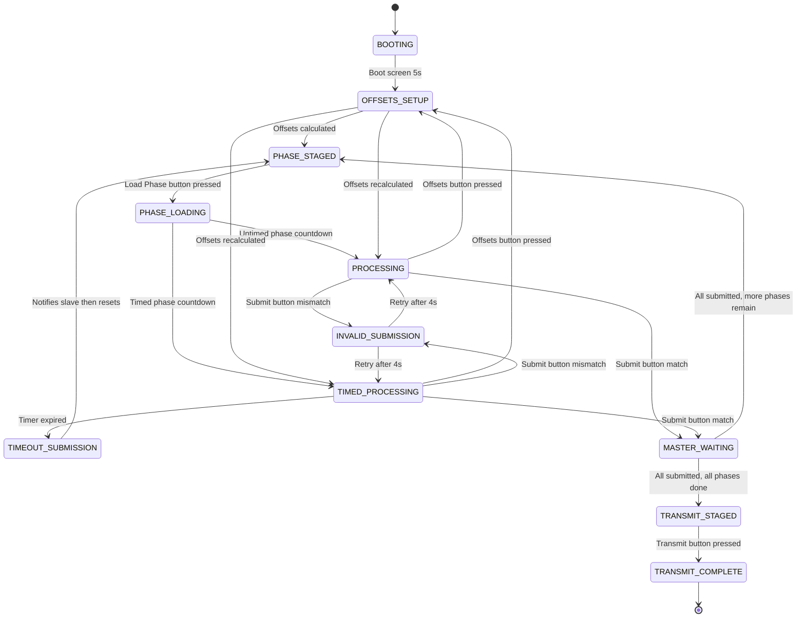

```mermaid
stateDiagram-v2
[*] --> BOOTING
BOOTING --> OFFSETS_SETUP : Boot screen 5s
OFFSETS_SETUP --> PHASE_STAGED : Offsets calculated
PHASE_STAGED --> PHASE_LOADING : Load Phase button pressed
PHASE_LOADING --> PROCESSING : Untimed phase countdown
PHASE_LOADING --> TIMED_PROCESSING : Timed phase countdown
PROCESSING --> OFFSETS_SETUP : Offsets button pressed
OFFSETS_SETUP --> PROCESSING : Offsets recalculated
TIMED_PROCESSING --> OFFSETS_SETUP : Offsets button pressed
OFFSETS_SETUP --> TIMED_PROCESSING : Offsets recalculated
PROCESSING --> INVALID_SUBMISSION : Submit button mismatch
TIMED_PROCESSING --> INVALID_SUBMISSION : Submit button mismatch
INVALID_SUBMISSION --> PROCESSING : Retry after 4s
INVALID_SUBMISSION --> TIMED_PROCESSING : Retry after 4s
TIMED_PROCESSING --> TIMEOUT_SUBMISSION : Timer expired
TIMEOUT_SUBMISSION --> PHASE_STAGED : Notifies slave then resets
PROCESSING --> MASTER_WAITING : Submit button match
TIMED_PROCESSING --> MASTER_WAITING : Submit button match
MASTER_WAITING --> PHASE_STAGED : All submitted, more phases remain
MASTER_WAITING --> TRANSMIT_STAGED : All submitted, all phases done
TRANSMIT_STAGED --> TRANSMIT_COMPLETE : Transmit button pressed
TRANSMIT_COMPLETE --> [*]
```
